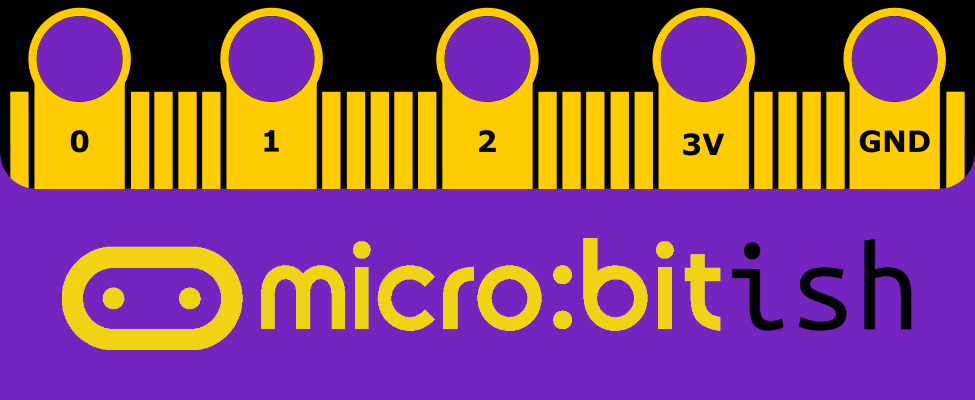
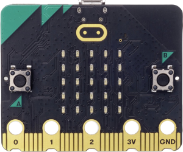
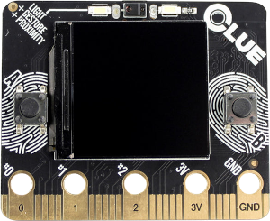
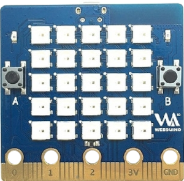
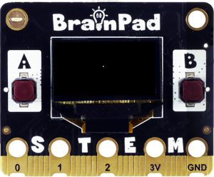
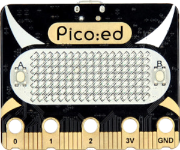
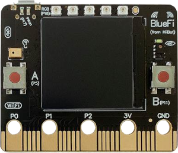
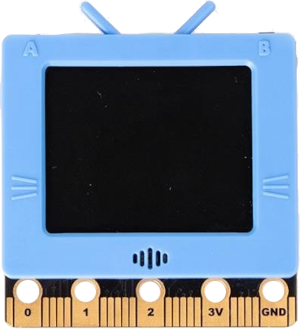
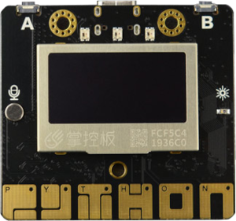
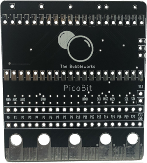

# micro:bitish Examples

This repository will contain examples of MicroPython code for various BBC micro:bit form factor boards. The code examples are for in introductory computer science class that uses micro:bit and other micro:bit form factor boards.  The examples are partitioned so they can be referenced in the curriculum.

---

> ## Contents
>
> ### [Boards](#boards)
>
> - [BBC micro:bit](#microbit1)
> - [Adafruit CLUE](#clue1)
> - [Banana Pi Web:Bit](#bpibit1)
> - [BrainPad Pulse](#brainpad1)
> - [Elecfreaks Pico:ed](#picoed1)
> - [HiiBot BlueFi](#bluefi1)
> - [KittenBot Future Board](#futureboard1)
> - [mPython Board](#mpython1)
> - [The Bubbleworks PicoBit](#picobit1)
>
> ### [Comparison of Specifications](#comparison)
>
> ### [Pinouts](#pinouts)
>
> ### [Examples](#examples)
>
> - BBC micro:bit
>   - Built-in
>     - Display
>       - [Displaying Strings](https://github.com/simonhasan/microbitish-examples/tree/main/examples/microbit/built-in/display/displaying-strings#displaying-strings-bbc-microbit)
> - Adafruit CLUE
>   - Built-in
>     - Display
>       - Displaying Strings
> - Banana Pi Web:Bit
>   - Built-in
>     - Display
>       - Displaying Strings
> - BrainPad Pulse
>   - Built-in
>     - Display
>       - Displaying Strings
> - Elecfreaks Pico:ed
>   - Built-in
>     - Display
>       - Displaying Strings
> - HiiBot BlueFi
>   - Built-in
>     - Display
>       - Displaying Strings
> - KittenBot Future Board
>   - Built-in
>     - Display
>       - Displaying Strings
> - mPython Board
>   - Built-in
>     - Display
>       - Displaying Strings
> - The BubbleWworks PicoBit
>   - Built-in
>     - LEDs
---

## Boards 

---

### BBC micro:bit

#### Documentation:

#### IDE: TODO

#### Advantages/Disadvantages

#### Purchasing:

This board is ubiquitous. It can be purchased just about anywhere.

> **WARNING**: Purchasing this board on Amazon is possible, but you will likely pay more than you need to pay. It is better to purchase this board through a reputable electronics store.

---

### Adafruit CLUE

The Adafruit CLUE is possibly the most advanced board in the set of micro:bit form factor boards and the most expensive. The board is programmed using Adafruit's dialect of MicroPython called CircuitPython. An overview of the board can be accessed [here](https://www.adafruit.com/product/4500) in the product description and [here](https://learn.adafruit.com/adafruit-clue/overview).

#### Documentation:

The documentation for this board is divided in several places. Documentation for the board can be accessed [here](https://learn.adafruit.com/adafruit-clue). The documentation for CircuitPython can be accessed [here](https://learn.adafruit.com/circuitpython-essentials/circuitpython-essentials). And the documentation for the board specific CircuitPython CLUE library can be accessed [here](https://docs.circuitpython.org/projects/clue/en/latest/api.html).

#### IDE: TODO

#### Advantages/Disadvantages:

The price may seem expensive, but it is worth the price given all the extras packed on the tiny board. The board also comes equipped with a Stemma QT/Quiic port for I2C sensors. All of the Adafruit sensors that have a CircuitPython library can be used with this board making it the most versatile of all the boards in the set. The documentation is very comprehensive for the board and all the possible accessories purchased through Adafruit. There is really no disadvantage to the board.

#### Purchasing:

This board can be purchased directly through [Adafruit](https://www.adafruit.com/clue), or [Digi-Key](https://www.digikey.com/short/r9h5qwwn) and [Mouser](https://www.mouser.com/ProductDetail/Adafruit/4500?qs=hWgE7mdIu5TtRDjG52zGqw%3D%3D).

---

### Banana Pi Web:Bit

I still need to determine whether this board uses micro:bit from the `microbit` module or a more standard version as there are references and links to both in the documentation.

#### Documentation:

#### IDE: TODO

#### Advantages/Disadvantages:

#### Purchasing:

This board can be purchased through [AliExpress](https://www.aliexpress.com/item/32861694375.html?spm=a2g0o.order_list.0.0.422c1802hQpTh2), or [Taobao](https://item.taobao.com/item.htm?spm=a1z10.5-c.w4002-5702696656.14.186f3d6fwcuPgz&id=567061033908) (for the more adventurous).

 

---

### BrainPad Pulse

#### Documentation:

#### IDE: TODO

#### Advantages/Disadvantages:

This board is by far the easiest to use as it is seems to be targeting the educational sector. The board has several accessories that are ready to use with the board out of the box. The team is very responsive if needed to be contacted. 

#### Purchasing:

This board can purchased through [Digi-Key](https://www.digikey.com/en/products/detail/ghi-electronics-llc/BPC-PULSE-D/15851391), and [Mouser](https://www.mouser.com/ProductDetail/GHI-Electronics/BPC-PULSE-D?qs=sGAEpiMZZMv0NwlthflBi8ta9pA8AH6ZiSYtvwb%252B0Ic%3D) in the United States. And [Everbest Media](https://www.everbestmedia.com/product-page/brainpad-pulse) in Asia.

---

### Elecfreaks Pico:ed

#### Documentation: 

The MicroPython documentation for this board can be found [here](https://www.elecfreaks.com/learn-en/pico-ed/index.html#). CircuitPython firmware is being developed for this board. Having both options will extend the functionality of this board.

#### IDE: TODO

#### Advantages/Disadvantages:

The MicroPython documentation for this board is very brief. Luckily Raspberry Pi Pico tutorials can be adapted with the Pico:ed pin mapping. The 7x17 LED matrix display has limited functionality compared to the other boards that have LED matrix displays. This only has two programmable buttons and a buzzer. This may seem underwhelming, but given the price of the board and the wealth of resources available for RP4020 boards, it is a good economical option. With CircuitPython the board will have many high quality components available from the Adafruit catalog.

#### Purchasing:

This board can be purchased through [RobotShop](https://www.robotshop.com/en/picoed-development-board-based-on-raspberry-pi-rp2040.html) and [Elmwood Electronics](https://elmwoodelectronics.ca/products/pico-ed) in North America (for faster delivery), [The Pi Hut](https://thepihut.com/products/pico-ed-rp2040-development-board) in the U.K, . or the [Elecfreaks Store](https://www.elecfreaks.com/picoed.html).

---

### HiiBot BlueFi

WAITING FOR THE BOARD TO ARRIVE

#### Documentation: 

The documentation is very extensive and well written for this board. Even though it is in Chinese the website can be translated in order to demonstrate all the great features this board has to offer. This documentation can be accessed [here](https://python4bluefi.readthedocs.io/zh_CN/latest/bluefi_intro/index.html).

#### IDE: TODO

#### Advantages/Disadvantages:

Purchasing the board can be challenging. But it has very similar functionality to the Adafruit CLUE. There are purchasing options that include a clear case to protect the screen and the sensors. The documentation seems to be very well written with very good tutorials to get the board operational. WRITE MORE WHEN THE BOARD ARRIVES.

#### Purchasing:

There is a link for this board on [Tindie](https://www.tindie.com/products/bradchan/hiibot-bluefi/), but the seller seems to inactive. Nevertheless the page still has useful information. The only place to get this board is on [Taobao](https://item.taobao.com/item.htm?spm=a1z09.2.0.0.cdb02e8ddCrv9l&id=633799976283&_u=i20dqgp5hged7a).

---

### KittenBot Future Board

#### Documentation:

#### IDE: TODO

#### Advantages/Disadvantages:

This boa
Develpopment on this board is limited toboard is limited to KittenBot has a small but active community on [Discord](https://discord.gg/tfbznRkN99). The moderators are helpful and very responsive.

#### Purchasing:

This board can be purchased through [Amazon](https://www.amazon.com/dp/B095KD38PJ?ref=ppx_yo2ov_dt_b_product_details&th=1), [Pimoroni](https://shop.pimoroni.com/products/kittenbot-future-board-esp32-aiot-python-education-kit?variant=39702080979027), [AliExpress](https://www.aliexpress.com/item/3256802167790726.html?spm=a2g0o.order_list.0.0.21ef1802Uv9ftL&gatewayAdapt=4itemAdapt), or the [KittenBot Store](https://www.kittenbot.cc/products/future-board-esp32-aiot-python-education-kit).

---

### mPython Board

#### Documentation:

This board has the best documentation. It is very well written and has many useful examples. The documentation can be accessed [here](https://mpython.readthedocs.io/en/master/index.html).

#### IDE: TODO

#### Advantages/Disadvantages:

#### Purchasing:

This board can purchased through [AliExpress](https://www.aliexpress.com/item/4001004308630.html?spm=a2g0o.order_list.0.0.ef7b1802ZJghxy), or [Taobao](https://item.taobao.com/item.htm?spm=a312a.7700824.w4002-23951518073.11.44d62c9dWjv0Zz&id=589150302447) (for the more adventurous).

---

### The Bubbleworks PicoBit

#### Documentation:

The repo for this product can be found [here](https://github.com/TheBubbleworks/AdapterBits).

#### Advantages/Disadvantages:

Because this is a breakout and not a proper board, It can not be fairly assessed in terms of what it does not have. What it does have is that it brings the Raspberry Pi Pico into the micro:bit accessory world. The creator is very responsive and helpful. 

#### Purchasing:

This breakout board can be purchased through [Tindie](https://www.tindie.com/products/thebubbleworks/picobit/).

---

## Comparison of Specifications

||BBC micro:bit V2|Adafruit CLUE|Banana Pi Web:Bit|BrainPad Pulse|Elecfreaks Pico:ed| HiiBot BlueFi| KittenBot Future Board| mPython Board |
|-|-|-|-| ------------------------------- | --------------------------------------------- | ------------------------------------------ | --------------------------------- | --------------------------------- |
| **CPU**                             | Arm Cortex-M4 32 bit                                         | Arm Cortex-M4 32 bit              | Dual-core 32 bit Xtensa LXG     | ?                               | Arm Cortex-M0,  Raspberry Pi RP2040 | Arm Cortex-M4                              | Arm Cortex-M4                     | Dual-core Tensilica LX6           |
| **RAM**                             | 128KB                                                        | 265KB                             | 520KB                           | ?                               | 256KB                                         | 520KB                                      | 8MB                               | 520KB                             |
| **ROM**                             | ?                                                            | ?                                 | 448KB                           | ?                               | ?                                             | 4MB                                        | ?                                 | ?                                 |
| **Flash**                           | 512KB                                                        | 2MB                               | 4096KB                          | ?                               | 2MB                                           | 2MB                                        | 4MB                               | 8MB                               |
| **Bluetooth**                       | ✓                                                            | ✓                                 | ✓                               | ✗                               | ✗                                             | ✓                                          | ✓                                 | ✓                                 |
| **WiFi**                            | ✓                                                            | ✓                                 | ✓                               | ✗                               | ✗                                             | ✓                                          | ✓                                 | ✓                                 |
| **Radio**                           | ✓                                                            | ✗                                 | ✗                               | ✗                               | ✗                                             | ✗                                          | ✓                                 | ✓                                 |
| **Display**                         | 5x5 red LED matrix                                           | 240x240 color display             | 5x5 RGB LED matrix              | 128x64 B&W display              | 7x17 red LED matrix                           | 240x240 color display                      | 160x128 color display             | 128x64 B&W display                |
| **GPIO Pins**                       | 3 rings 19 assignable pins                              | 3 rings 19 assignable pins   | 3 rings 19 assignable pins | 3 rings 19 assignable pins | 3 rings 19 assignable pins               | 3 rings 19 assignable pins            | 3 rings 19 assignable pins   | 1 ring 20 assignable pins    |
| **Programmable Buttons**       | A and B 1 captive touch button 3 captive touch pads | A and B 3 captive touch pads | A and B                         | A and B                         | A and B                                       | A and B                                    | A and B 3 captive touch pads | A and B 6 captive touch pads |
| **Programmable LEDs**               | 25 red LEDs                                                  | 1 RGB LED 2 white LEDS       | 25 RGB LEDs                     | ✗                               | ✗                                             | 5 RGB LEDs 1 red LED 1 white LED | 3 RGB LEDs                        | 3 RGB LEDs                        |
| **Buzzer**                          | ✓                                                            | ✓                                 | ✓                               | ✓                               | ✓                                             | ✓                                          | ✓                                 | ✓                                 |
| **Accelerometer**                   | ✓                                                            | ✓                                 | ✓                               | ✓                               | ✗                                             | ✓                                          | ✓                                 | ✓                                 |
| **Barometric Pressure Sensor** | ✗                                                            | ✓                                 | ✗                               | ✗                               | ✗                                             | ✗                                          | ✗                                 | ✗                                 |
| **Color Sensor**                    | ✗                                                            | ✓                                 | ✗                               | ✗                               | ✗                                             | ✓                                          | ✗                                 | ✗                                 |
| **Gesture Sensor**                  | ✗                                                            | ✓                                 | ✗                               | ✗                               | ✗                                             | ✓                                          | ✗                                 | ✗                                 |
| **Gyroscope**                       | ✗                                                            | ✓                                 | ✓                               | ✗                               | ✗                                             | ✓                                          | ✗                                 | ✗                                 |
| **Humidity Sensor**                 | ✗                                                            | ✓                                 | ✗                               | ✗                               | ✗                                             | ✓                                          | ✗                                 | ✗                                 |
| **Light Sensor**                    | ✓                                                            | ✓                                 | ✓                               | ✗                               | ✗                                             | ✓                                          | ✓                                 | ✓                                 |
| **Magnetometer**                    | ✓                                                            | ✓                                 | ✓                               | ✗                               | ✗                                             | ✓                                          | ✗                                 | ✓                                 |
| **Proximity Sensor**                | ✗                                                            | ✓                                 | ✗                               | ✗                               | ✗                                             | ✓                                          | ✗                                 | ✗                                 |
| **Sound Sensor**                    | ✓                                                            | ✓                                 | ✗                               | ✗                               | ✗                                             | ✓                                          | ✓                                 | ✓                                 |
| **Temperature Sensor**              | ✓                                                            | ✓                                 | ✓                               | ✓                               | ✗                                             | ✓                                          | ✓                                 | ✗                                 |
| **SD Card Slot**                    | ✗                                                            | ✗                                 | ✗                               | ✗                               | ✗                                             | ✗                                          | ✓                                 | ✗                                 |
| **External Connector**              | ✗                                                            | Qwiic/STEMMA QT                   | ✗                               | ✗                               | ✗                                             | Qwiic/STEMMA QT                            | ✗                                 | ✗                                 |

---

## Pinouts

| Pin    | [BBC micro:bit](https://microbit.pinout.xyz/) | [Adafruit CLUE](https://cdn-learn.adafruit.com/assets/assets/000/110/604/original/adafruit_products_Adafruit_nRF52840_CLUE_pinout.png?1649357646) | [Banana Pi Web:Bit](https://wiki.banana-pi.org/images/a/a1/Bpi_bit_gpio_detail-05.jpg) | [BrainPad Pulse](https://www.brainpad.com/wp-content/uploads/2021/06/BrainPadPulsePinOut-768x371.jpg) | [Elecfreaks Pico:ed](https://images.elecfreaks.com/wysiwyg/products/2021/EF01033/picoed_introduce_970_3.jpg) | [HiiBot BlueFi](https://python4bluefi.readthedocs.io/zh_CN/latest/_static/images/bluefi_intro/BlueFi_board_IF.jpg) | [KittenBot Future Board](https://cdn.shopifycdn.net/s/files/1/0193/0946/1603/files/5_8183a9aa-3107-45c5-b1d3-d9fc08f12b7e_1024x1024.png?v=1632557592) | [mPython Board](https://mpython.readthedocs.io/en/master/_images/mPython%E6%8E%8C%E6%8E%A7%E6%9D%BF_pin_define.jpg) | [The Bubbleworks PicoBit](https://github.com/TheBubbleworks/AdapterBits/#pin-mapping) |
| ------ | --------------------------------------------- | ------------------------------------------------------------ | ------------------------------------------------------------ | ------------------------------------------------------------ | ------------------------------------------------------------ | ------------------------------------------------------------ | ------------------------------------------------------------ | ------------------------------------------------------------ | ------------------------------------------------------------ |
|**P0**| `pin0` *Analog, PWM*                     | `D0`,`P0`,`A2` *Analog, PWM*                            |                                                              | `P0` *Analog*, *PWM*                                    | `pin.P0` *Analog*                                       |                                                              | `'P0'`                                                       | `0`                                                          |                                                              |
| **P1**  | `pin1` *Analog, PWM*                     | `D1`,`P1`,`A3` *Analog, PWM*                            |                                                              | `P1` *Analog*, *PWM*                                    | `pin.P1` *Analog*                                       |                                                              | `'P1'`                                                       | `1`                                                          |                                                              |
| **P2**  | `pin2` *Analog, PWM*                     | `D2`,`P2`,`A4` *Analog, PWM*                            |                                                              | `P2` *Analog*, *PWM*                                    | `pin.P2` *Analog*                                       |                                                              | `'P2'`                                                       | `2`                                                          |                                                              |
| **P3**  | `pin3` **LED Col 3**, *Analog, PWM*      | `D3`,`P3`,`A5` *Analog, PWM*                            |                                                              | `P3` *Analog*, *PWM*                                    | `pin.P3` *Analog*                                       |                                                              | `'P3'4`                                                      | `3`                                                          |                                                              |
| **P4**  | `pin4` **LED Col 1**, *Analog, PWM*      | `D4`,`P4`,`A6` *Analog, PWM*                            |                                                              | `P4` *Analog*                                           | `pin.P4`                                                     |                                                              | `'P4'`                                                       | `4`                                                          |                                                              |
| **P5**  | `pin5` **Button A**                      | `D5`,`P5`,`BUTTON_A` **Button A**, *PWM*                |                                                              | `P5` *Analog*                                           | `pin.P5`                                                     |                                                              | `'P5'`                                                       | `5`                                                          |                                                              |
| **P6**  | `pin6` **LED Col 4**                     | `D6`,`P6` *PWM*                                         |                                                              | `P6` *Analog*                                           | `pin.P6`                                                     |                                                              | `'P6'`                                                       | `6`                                                          |                                                              |
| **P7**  | `pin7` **LED Col 2**                     | `D7`,`P7` *PWM*                                         |                                                              | `P7` *Analog*                                           | `pin.P7`                                                     |                                                              | `'P7'`                                                       | `7`                                                          |                                                              |
| **P8**  | `pin8`                                   | `D8`,`P8` *PWM*                                         |                                                              | `P8` **UART: TX**, *PWM*                                | `pin.P8`                                                     |                                                              | `'P8'`                                                       | `8`                                                          |                                                              |
| **P9**  | `pin9`                                   | `D9`,`P9` *PWM*                                         |                                                              | `P9` *Analog*                                           | `pin.P9`                                                     |                                                              | `'P9'`                                                       | `9`                                                          |                                                              |
| **P10** | `pin10` **LED Col 5**, *Analog, PWM*     | `D10`,`P10`,`A0` *Analog, PWM*                          |                                                              | `P10` *Analog*                                          | `pin.P10`                                                    |                                                              | `'P10'`                                                      | `10`                                                         |                                                              |
| **P11** | `pin11` **Button B**                     | `D11`,`P11`,`BUTTON_B` **Button B**, *PWM*              |                                                              | `P11`                                                        | `pin.P11`                                                    |                                                              | `'P11'`                                                      | `11`                                                         |                                                              |
| **P12** | **Reserved**                                  | `D12`,`P12` *Analog, PWM*                               |                                                              | `P12` **UART: RX**, *PWM*                               | `pin.P12`                                                    |                                                              | `'P12'`                                                      | `12`                                                         |                                                              |
| **P13** | `pin13` **SPI: SCK**                     | `D13`,`P13`,`SCK` **SPI: SCK**, *PWM*                   |                                                              | `P13` **SPI: SCK**                                      | `pin.P13`                                               |                                                              | `'P13'`                                                      | `13`                                                         |                                                              |
| **P14** | `pin14` **SPI: MISO**                    | `D14`,`P14`,`MISO` **SPI: MISO**, *PWM*                 |                                                              | `P14` **SPI: MISO**                                     | `pin.P14`                                                    |                                                              | `'P14'`                                                      | `14`                                                         |                                                              |
| **P15** | `pin15` **SPI: MOSI**                    | `D15`,`P15`,`MOSI` **SPI: MOSI**, *PWM*                 |                                                              | `P15` **SPI: MOSI**                                     | `pin.P15`                                                    |                                                              | `'P15'`                                                      | `15`                                                         |                                                              |
| **P16** | `pin16`                                  | `D16`,`P16`,`A1` *Analog, PWM*                          |                                                              | `P16`                                                        | `pin.P16`                                                    |                                                              | `'P16'`                                                      | `16`                                                         |                                                              |
| **P19** | `pin19` **I2C: SCL**                     | `D19`,`P19`,`SCL` **I2C: SCL**, *PWM*                   |                                                              | `P19` **I2C: SCL**                                      | `pin.P19` **I2C: SCL**                                  |                                                              | `'P19'`                                                      | `19`                                                         |                                                              |
| **P20** | `pin20` **I2C: SDA**                     | `D20`,`P20`,`SDA` **I2C: SDA**, *PWM*                   |                                                              | `P13` **I2C: SDA**                                      | `pin.P20` **I2C: SDA**                                  ||`'P20'`|`20`||

---

