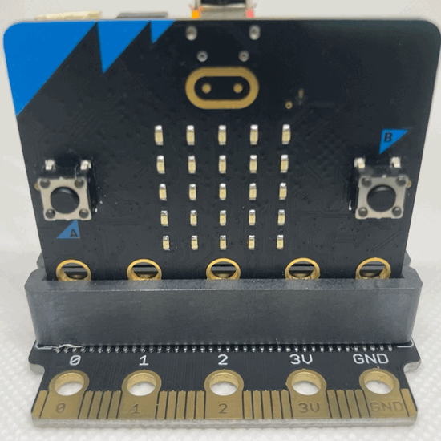

# Displaying a String (BBC micro:bit)

The BBC micro:bit display is a 5×5 matrix of red LEDs. Strings are displayed by either scrolling the characters of the string from right to left or displaying each character individually. In order to display strings the `microbit` module must be imported.

---

###  <a name="disp-str-microbit0"></a>0.0.0.0.0: Displaying a String

---

> ### `display.scroll(string)`
>
> Display a string from right to left.

```python
# display-string-microbit1.py
from microbit import *

text = 'Python'

display.scroll(text)
```


To display each character of the string individually use:

> ### `display.show(string)`

```python
# display-string-microbit2.py
from microbit import *

text = 'Python'

display.show(text)
```

The method presented above displays each character of the string `Python` individually as demonstrated below:


> **NOTE**: The `display.show()` method does not clear the screen by default, leaving the final character on the display.

---

### <a name="disp-str-add-microbit0"></a>0.0.0.0.1: Displaying a String (Optional Methods)

---

#### <a name="disp-str-add-microbit1"></a>0.0.0.0.0.0: Displaying a String with a Delay 

It is possible to change the speed of the string is scrolling in milliseconds with the `delay=ms` argument. This argument changes the speed of the increments from right to left. The default value is `delay=400` milliseconds.

> ### `display.scroll(string, delay=ms)`

```python
# display-string-delay-microbit1.py
from microbit import *

text = 'Python'

display.scroll(text, delay=100)
```

The code above changes the increments of the scrolling speed from the default `400` to `100`, resulting in a faster scrolling speed from right to left. This is demonstrated below:


There is a `delay` argument for `display.show()` that

> ### `display.show(string, delay=ms)`

```python
# display-string-delay-microbit2.py
from microbit import *

text = 'Python'

display.show(text, delay=100)
```



**WORD THIS BETTER!**

---

#### <a name="disp-str-add-microbit2"></a>0.0.0.0.0.1: Displaying a String with a Loop

Both the `display.scroll()` and `display.show()` methods only run once without a `while` loop. It is possible to loop the strings without an explicit `while` loop using the `loop=bool` argument. The default value is `loop=False`.

> ### `display.scroll(string, loop=bool)`

**TODO**

```python
# display-string-loop-microbit1.py
from microbit import *

text = 'Python'

display.scroll(text, loop=True)
```


**TODO**

> ### `display.show(string, loop=bool)`

```python
# display-string-loop-microbit1.py
from microbit import *

text = 'Python'

display.scroll(text, loop=True)
```


---

#### <a name="disp-str-add-microbit3"></a>0.0.0.0.0.2: Clearing the Display

**TODO**

> ### `display.scroll(string, clear=bool)`

**TODO** `display.show(text, clear=True)`

```python
# This will return a TypeError
from microbit import *

text = 'Python'

display.show(text, clear=True)
```

**TODO**

```
Traceback (most recent call last):
  File "<stdin>", line 6, in <module>
TypeError: extra keyword arguments given
```

**TODO**

> ### `display.show(string, clear=bool)`

**TODO**

```python
# display-string-clear-microbit.py
from microbit import *

text = 'Python'

display.show(text, clear=True)
```


